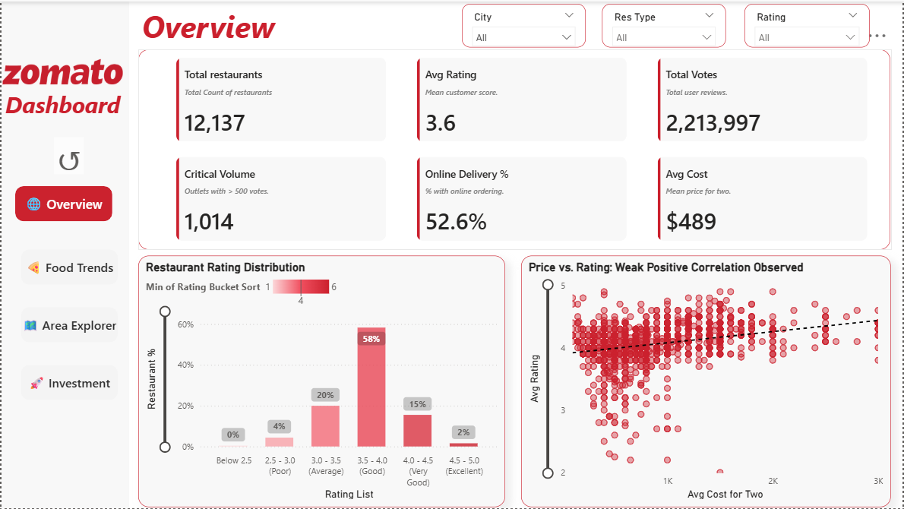
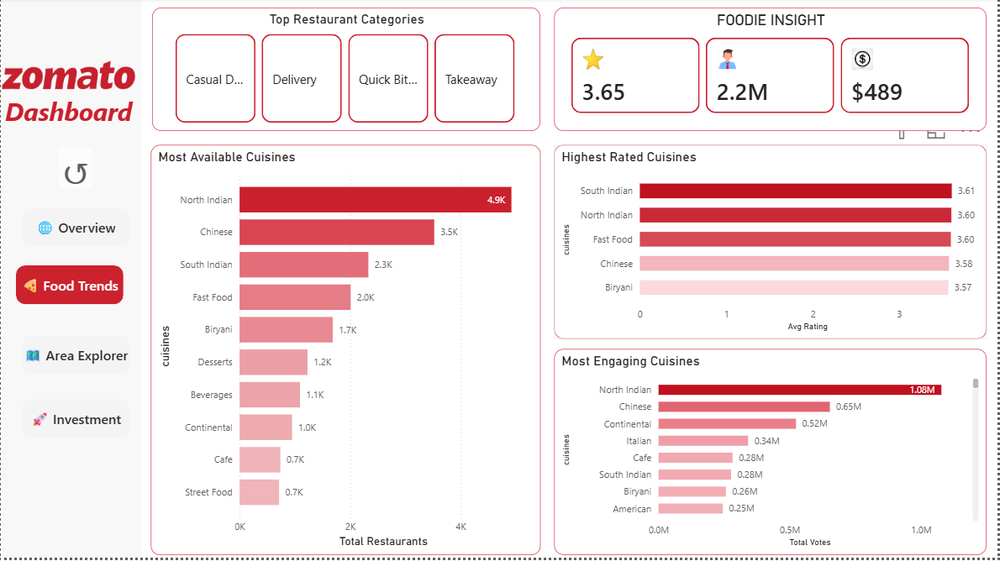
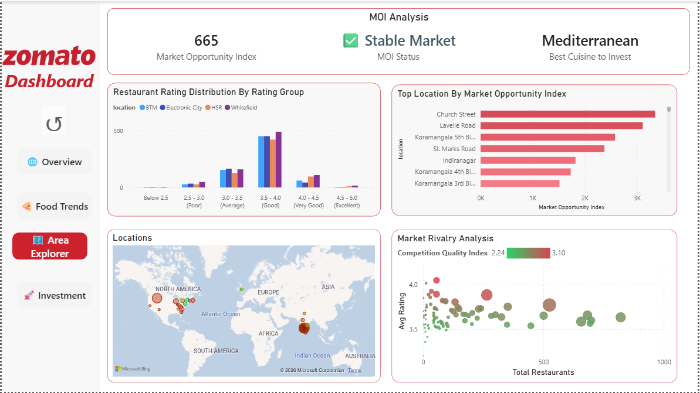

# 🍽️ Zomato Bangalore Restaurant Analysis


---

## 📊 Project Summary

This project analyzes the Bangalore restaurant market to identify patterns and success factors for new outlets. The primary objective was to transform a massive, unstructured **547 MB** dataset into a clean, **1.2 MB** business-ready analytical engine powering an interactive Power BI dashboard.

## 🏢 Business Use Case

This dashboard simulates a real-world consulting scenario:

A restaurant investor wants to:

* Identify high-growth cuisine categories

* Avoid oversaturated neighborhoods

* Understand competitive intensity

* Optimize pricing positioning

This solution provides data-backed strategic guidance.

### 📉 Impact Metrics

| Metric | Before | After |
| :--- | :--- | :--- |
| **Dataset Size** | 547 MB | 1.2 MB |
| **Reduction** | --- | **99.7%** |
| **Rows** | ~50,000 | Optimized |
| **Performance** | Slow / Laggy | **BI-Ready (Real-time)** |
| **GitHub Compatible** | ❌ No | ✅ Yes |

---

## 🖼️ Dashboard Overview

### 1. Market Overview & Performance



* **Scale:** Tracks **12,137 restaurants** with over **2.2 million user votes**.
* **Digital Adoption:** **52.6%** of outlets offer online delivery, indicating a mature digital market.
* **Rating Trends:** **58%** of restaurants sit in the "Good" (3.5–4.0) range.
* **Price Correlation:** Analysis reveals a **weak positive correlation** between cost and ratings, suggesting price isn't the sole driver of satisfaction.

* **Business Value**: Provides macro-level understanding of demand, digitization level, and pricing behavior.

### 2. Food Trends & Cuisine Analysis



* **Volume Leaders:** **North Indian** (4.9K) and **Chinese** (3.5K) outlets dominate the landscape.
* **Engagement:** North Indian cuisine leads with **1.08 million votes**, followed by Chinese and Continental.
* **Quality Benchmark:** **South Indian** cuisine maintains the highest average rating (**3.61**).
* **Business Value**: Separates popularity from quality to identify reliable vs saturated segments.

### 3. Area Explorer & Market Opportunity



* **Investment IQ:** Identified **Mediterranean** as the optimal cuisine for new market entry.
* **Hotspots:** Ranked **Church Street** and **Lavelle Road** as top-tier locations using a custom Market Opportunity Index.
* **Rivalry Analysis:** Visualized market saturation vs. quality using a custom **Competition Quality Index (CQI)**.

### 4. Investment Roadmap & Strategy


* **Competitive Tiers:** Categorized high-stakes zones as **"Shark Tank (Elite)"** (e.g., Lavelle Road).
* **Strategic Fit:** Recommends specific niches like **American** for Church Street and **Salad Bars** for Lavelle Road.
* **Budget Mapping:** Segments opportunities into **High, Mid, and Low-budget** investment paths.
* **Example Insight**: Church Street and Lavelle Road rank as high-quality, high-intensity zones — suitable for premium concepts.

## 🧪 Analytical Framework

To drive the Investment Roadmap, I engineered two custom KPIs to measure market potential beyond simple ratings:

* **Market Opportunity Index (MOI):** A weighted score calculating the ratio of user engagement (Votes) to cuisine density. It identifies "underserved" high-demand pockets.
* **Competition Quality Index (CQI):** Assesses rival "strength" by analyzing "Critical Volume" outlets (>500 votes) and rating consistency in specific neighborhoods.

---

## 🧱 Data Model Architecture

### 🔗 Data Model Design

The analytical model follows a star-schema inspired structure to ensure performance and scalability inside Power BI.

### Core Fact Table

* Restaurant Performance Metrics

  * Votes
  * Rating
  * Approx Cost for Two
  * Online Delivery Flag
  * Cuisine Tags

  **Dimension Attributes**
  * Location
  * Cuisine Category
  * Price Range
  * Rating Bucket
  * Delivery Status

### Why This Matters

* Reduced relationship complexity
* Improved filter propagation
* Faster DAX evaluation
* Cleaner KPI computation

This structure ensures analytical flexibility while maintaining optimal performance.

## 🛠️ Data Engineering Process

### 🔎 The Challenge

The raw dataset was 547MB—too large for GitHub and too slow for fluid BI interactions. Issues included heavy text columns, duplicate records, and inconsistent formatting.

### ⚙️ Actions Taken

* **Removed duplicates** and cleaned/standardized null values.
* **Optimized data types** to reduce the memory footprint dramatically.
* **Structured data** specifically for high-performance Power BI DAX calculations.

---

## 📊 Analytical Design Decisions

1️⃣ Why Use Total Votes Instead of Review Count?

Votes reflect engagement strength and customer traction, making them a stronger proxy for demand intensity.

2️⃣ Why Not Use Only Average Rating?

High ratings without vote volume can indicate low statistical reliability.

3️⃣ Why Create Custom Indices Instead of Raw Metrics?

Raw metrics show performance.
Indices show opportunity.

This distinction elevates the dashboard from descriptive to strategic analytics.

## 🧪 Lessons Learned

Large datasets require structural optimization before visualization.

Text-heavy columns dramatically impact memory usage.

Custom KPIs create competitive differentiation in analysis.

Business framing matters more than just visual design.

Performance tuning in Power BI starts with data modeling — not visuals.

## 🚀 Future Improvements

Planned enhancements:

* Time-series trend analysis (if historical data becomes available)

* Predictive modeling for rating estimation

* Geospatial clustering visualization

* Automated pipeline with parameterized ETL

* SQL-based warehouse version of the dataset

## 📈 Business Questions Answered

Which cuisines show strongest demand-to-competition ratios?

Where are premium investment zones?

Does higher pricing improve ratings?

Which areas show emerging growth potential?

How intense is competitive quality across locations?

## 📂 Repository Structure

```text
├── assets/
│   └── screenshots/    # Dashboard images
├── data/
│   ├── raw/            # Original 547MB CSV (Linked/Zipped)
│   └── processed/      # Cleaned 1.2MB CSV used for analysis
├── notebooks/
│   └── cleaning.py     # Python data transformation pipeline
├── reports/
│   └── dashboard.pbix  # Interactive Power BI Dashboard
└── README.md
```

## 🚀 How to Reproduce

* Download Raw Dataset

   Source: **Kaggle (Zomato Bangalore dataset)**

* Run Cleaning Pipeline

    python notebooks/cleaning.py

* Open Dashboard

   Open reports/dashboard.pbix using Power BI Desktop.

## 💻 Tech Stack & Skills

**Languages & Libraries**: Python (Pandas, NumPy), SQL, DAX.

**Visualization**: Power BI (Multi-page Interactive Dashboards).

**Data Engineering**: Data Cleaning, ETL Pipelines, Performance Optimization.

**Business Analysis**: KPI Development, Market Opportunity Mapping, Trend Analysis.

## 👤 Author

### Bholme Thet Pai

### Aspiring Data Analyst
